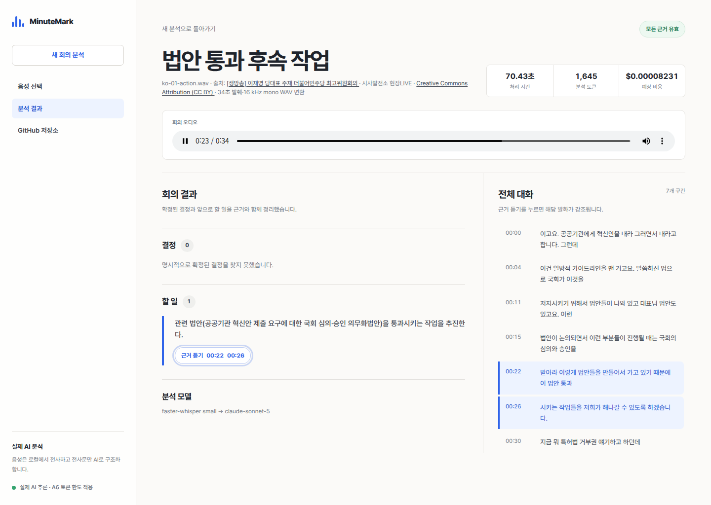
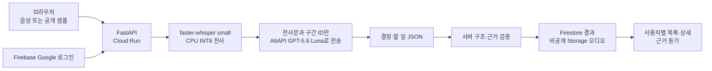
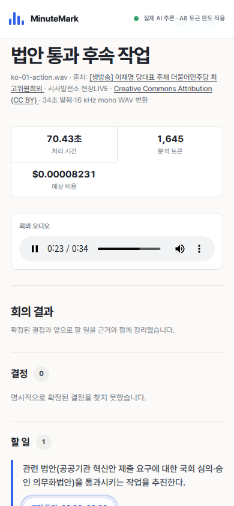

# MinuteMark

실제 회의 음성을 전사하고, 회의에서 확정된 결정과 할 일을 근거 발화와 함께
보여주는 AI 회의 노트입니다.

[현재 공개 V1 실행해 보기](https://minutemark-2u3l25uhba-du.a.run.app) ·
[GitHub 저장소](https://github.com/hangokudao/minutemark) ·
[데모 녹화 대본](./docs/DEMO_SCRIPT.md)



## 무엇을 복제했나

Otter류 AI 회의 서비스의 핵심 경험만 3일 MVP 범위로 재구성했습니다.

1. 회의 음성 입력
2. 타임스탬프 전사
3. 결정과 할 일 구조화
4. 결과에서 근거 발화로 이동

V2 후보에는 Google 회원가입·로그인, 사용자별 회의 저장·재열람, 회의 삭제,
재인증 기반 계정 탈퇴와 개인정보처리방침까지 추가했습니다. 협업, 댓글,
실시간 회의 봇은 계속 제외해 한 개의 완결된 수직 흐름에 집중했습니다.

## 실제 AI 흐름



음성 원본은 A6API에 보내지 않습니다. 서버에서 Whisper로 전사한 텍스트와
구간 ID만 전송합니다.

## 핵심 기능

- WAV, MP3, M4A, OGG, FLAC, WEBM 업로드
- 실제 공개 한국어 회의 샘플 2개
- `faster-whisper/small`의 타임스탬프 전사
- A6API `gpt-5.6-luna`의 결정·할 일 추출
- 존재하는 전사 구간만 허용하는 서버 검증
- 결과의 `근거 듣기`에서 오디오 seek와 전사 강조
- Firebase Authentication 기반 Google 회원가입·로그인·로그아웃
- Firebase UID 소유권으로 분리된 회의 목록·상세와 5분 signed audio URL
- 성공한 분석만 Firestore·비공개 Storage에 저장하고 실패 시 오디오 보상 삭제
- 멱등 분석 요청, 회의 삭제, 최근 Google 재인증 후 content-first 계정 탈퇴
- 로그인 전 접근 가능한 개인정보처리방침과 데스크톱·모바일 `새 회의`
- 처리 시간, 토큰, 예상 API 비용 표시
- 20MB·2분·동시 처리 1·계정당 회의 5개·전체 오디오 512MiB 보호선
- 공개 샘플 영속 캐시, Firestore 750KiB 사전 거부, 비공개 응답 `no-store`
- CSP·프레임 차단·HSTS·MIME 보호와 비루트 Docker 실행

## 실제 실행 결과

아래 표는 2026-07-31 Windows Chrome에서 당시 공개 V1 배포를 직접 실행한
결과입니다. 현재 V1은 Luna로 전환됐고, V2 후보는 아직 배포하지 않았습니다.

| 입력 | 전체 처리 | 결과 | 근거 이동 | 예상 A6 비용 |
| --- | ---: | --- | --- | ---: |
| 법안 통과 후속 작업 | 39.75초 | 전사 7구간, 할 일 1개 | S5·S6 → 약 23.72초 | $0.00008890 |
| KTX 노선 변경 결정 | 35.94초 | 전사 13구간, 결정 1개 | 인용 구간 → 약 0.92초 | $0.00010337 |
| 직접 WAV 업로드 | 34.90초 | 전사 13구간, 결정 1개 | S1 → 약 0.40초 | $0.00010985 |

두 공개 샘플은 Cloud Run 로그에서 HTTP 200을 확인했습니다. 직접 WAV 업로드도
Windows Chrome에서 실제 결과와 오디오 이동을 확인했으며, 모든 결과의 근거
구간이 실제 전사에 존재했습니다.

## 장애를 제품 동작으로 바꾼 과정

A6 스마트 라우터는 판매자에 따라 OpenAI 호환 기능 지원 범위가 달랐습니다.

- 일시적 502: 네트워크·5xx에 한해 1회 재시도
- `response_format=json_schema`의 HTTP 400: 일반 JSON 요청으로 한 번 폴백
- 폴백 응답: 서버에서 필수 필드와 타입을 다시 검증
- 모델이 `"S5, S6"` 문자열을 반환한 사례: 구간 ID를 정규화한 뒤 실재 여부 재검증
- 검증 실패: 사용자 결과로 내보내지 않고 안전한 오류로 종료

공개 환경에서도 실제 400이 발생했으며, 폴백 후 HTTP 200과 근거 검증 통과를
확인했습니다.

## Docker와 배포

- 애플리케이션: FastAPI + Vanilla JavaScript
- 전사: `faster-whisper 1.2.1`, `small`, CPU INT8
- 구조화: A6API `gpt-5.6-luna`
- 패키징: Docker
- 호스팅: Google Cloud Run 서울 리전
- 리소스: 2 vCPU, 4 GiB, 동시 처리 1, 최소 0
- 현재 공개 V1 리비전: `minutemark-00007-w6c`
- 이미지 digest:
  `sha256:df7219e1804e3001677ab43a3603f2c38ef76b14d020126415a210b572ac32e4`

### 비용 보호

| 보호선 | 상태 |
| --- | --- |
| 앱 추정 A6 월 예산 | $1 |
| Cloud Run 서비스 최대 인스턴스 | 1, 확인 완료 |
| Google Cloud 프로젝트 예산 | 월 ₩1,000 |
| 결제 알림 | 50%·90%·100%, `myhanbro@gmail.com` |
| A6 토큰 하드 한도 $1 | 총 $1.00, 남은 $0.99 확인 완료 |

Google Cloud 예산은 알림이며 결제를 자동 중단하는 하드 캡이 아닙니다.
A6API 토큰 `local-meeting-notes-mvp`의 총한도는 $1.00으로 설정했습니다.

## 브라우저 QA 상태

| 검증 | 상태 | 증거 |
| --- | --- | --- |
| Windows Chrome 데스크톱 1440×900 | PASS | 겹침·잘림·비의도적 가로 스크롤 없음 |
| 공개 샘플 2개 실제 분석 | PASS | 화면 결과와 Cloud Run POST 200 |
| 근거 듣기 | PASS | 오디오 seek와 전사 강조 |
| 모바일 390×844 랜딩 | PASS | 격리 headless Chrome fallback |
| WAV 파일 업로드 | PASS | 실제 34.90초 분석과 근거 이동 확인 |
| 실패·재시도 상태 | PASS | 안전한 한국어 안내만 표시, 내부 오류·경로 없음 |
| 오류 경로 콘솔·네트워크 | PASS | 콘솔 오류 없음, Cloud Run POST 422 두 번 |

2026-08-02 V2 로컬 후보의 Windows Chrome QA에서는 게스트 화면,
개인정보처리방침, 데스크톱 캡처와 콘솔 error/warn 0건까지 확인했습니다. Google
계정 선택 뒤 브리지의 `Runtime.evaluate`가 timeout 되어 로그인 후 업로드·저장·
재열람·삭제·탈퇴와 모바일 390×844 검증은 `FAILED / 미검증`입니다. 같은 상태 변경
흐름을 다른 자동화로 성공 처리하지 않았습니다.



스크린샷과 검증 결과는 실제 공개 URL 기준입니다. 조작 영상이 필요한 경우
[데모 녹화 대본](./docs/DEMO_SCRIPT.md)의 66초 순서로 한 번만 녹화하면 됩니다.

## 로컬 실행

`.env.example`을 `.env`로 복사하고 A6API 키를 넣습니다.

```sh
docker compose run --rm sample-downloader
docker compose up --build web
```

브라우저에서 `http://localhost:8000`을 엽니다.

회귀 테스트:

```sh
docker compose run --rm -v ./tests:/tests:ro --entrypoint python web \
  -m unittest discover -s /tests -v
```

현재 기존 분석 회귀 15개와 Firebase token 검증, 인증 전 body 차단, 사용자
소유권, 저장 한도, 객체 generation 고정, 고아 객체 정리, 보상 삭제,
content-first 탈퇴, 멱등 생성·삭제를 포함한 V2 테스트 18개까지 총 33개가
통과합니다. 최종 이미지의 `pip-audit`도 알려진
취약점 0건입니다.

## 자동 배포

GitHub `main`이 배포 정본입니다. `main`에 병합하면 Cloud Build가
[`cloudbuild.yaml`](./cloudbuild.yaml)에 따라 다음 순서로 실행합니다.

1. Docker 이미지 빌드
2. 회귀 테스트 33개
3. Git 커밋 SHA로 이미지 태그 후 Artifact Registry에 push
4. 기존 Cloud Run `minutemark` 서비스에 배포

`/api/health`의 `commit` 값과 GitHub `main` SHA가 같으면 배포가 동기화된
상태입니다. 배포 명령은 Secret Manager의 `minutemark-a6-api-key` 버전 `1`,
전용 `minutemark-runtime` 서비스 계정, 최대 인스턴스 `1`, 동시 처리 `1`을
명시적으로 고정합니다. 현재 런타임 서비스 계정에는 해당 secret 접근 권한이
없으므로 권한 승인 전 V2 배포는 차단됩니다. 수동
[`cloudrun-deploy.sh`](./cloudrun-deploy.sh)는 최초 설정이나 복구용입니다.

## 문서

- [운영·검증 기록](./NOTES.md)
- [V2 제품·구현 계획](./docs/V2_PRODUCT_PLAN.md)
- [서버 전용 Firestore deny-all 규칙](./firestore.rules)
- [공개 오디오 출처와 라이선스](./PUBLIC_AUDIO_SAMPLES.md)
- [66초 데모 녹화 대본](./docs/DEMO_SCRIPT.md)

## 라이선스

소스 코드와 자체 제작 문서·이미지는 [MIT](./LICENSE)입니다. 번들된
`samples/korean/*.wav`는 MIT 적용 대상이 아니며, 각 원본의 CC BY 조건과
[저작자·출처·가공 표시](./PUBLIC_AUDIO_SAMPLES.md)를 따릅니다.

## 현재 제한

- V2 후보는 로컬 구현·검증 상태이며 현재 공개 Cloud Run 리비전에는 배포하지
  않았습니다.
- Windows Chrome 브리지 오류로 실제 Google 로그인 이후 전체 사용자 흐름과
  모바일 viewport QA를 완료하지 못했습니다.
- 로컬 ADC 계정에는 runtime 서비스 계정의 `signBlob` 권한을 부여하지 않아
  signed audio URL 통합 테스트가 403이었습니다. QA 객체는 즉시 삭제됐고, 운영
  runtime 서비스 계정의 self-sign 최소권한은 정책에서 확인했지만 배포 실행은
  아직 검증하지 않았습니다.
- A6API의 전사문 보관 기간·학습 사용·처리 국가·재위탁 조건은 확인되지 않아
  회원 업로드의 공개 출시는 보류합니다.
- Cloud Run의 로컬 SQLite 예산 장부는 인스턴스 재시작 시 초기화될 수 있습니다.
- 공개 데모는 한 번에 한 분석만 처리합니다.
- A6 스마트 라우터 판매자에 따라 구조화 출력 지원이 달라 서버 폴백과 검증을
  사용합니다.
