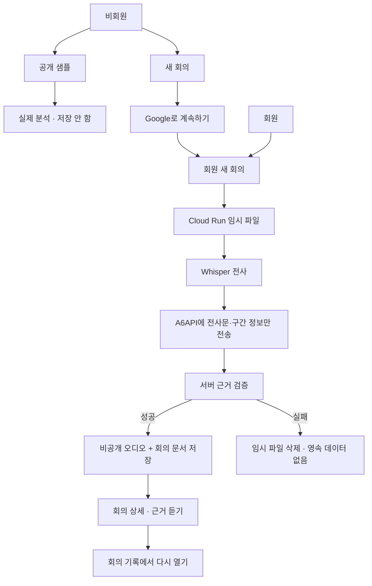
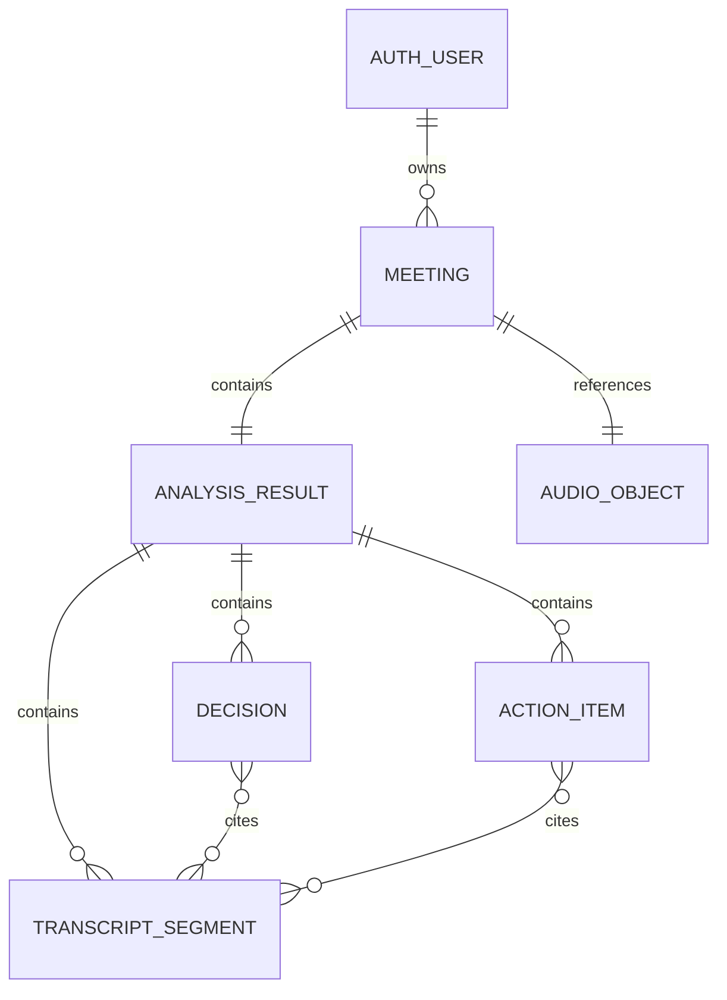

# MinuteMark V2 제품·구현 계획

> 상태: 구현 완료 · 공개 출시 보류
> 기준: 현재 `codex/redesign-v1`의 V1 UI와 기존 FastAPI 분석 계약
> 결정 질문: 포트폴리오 완성도는 높이되, 실제 운영 가능한 최소 회원 기반 서비스는 어디까지인가?

### 2026-08-02 실행 판정

요청 범위는 한 번에 구현했다. 단계별 승인을 기다리는 Phase 문서는 이제 작업
순서가 아니라 검증 체크리스트로 사용한다. 현재 판정은 `IMPLEMENTED / RELEASE
BLOCKED`다.

| 축 | 증거 | 판정 |
| --- | --- | --- |
| 인증·API | Firebase ID token 서명·만료·폐기 확인, 인증 전 multipart body 차단 | 코드·테스트 PASS |
| 저장·소유권 | UID 하위 Firestore 문서, 비공개 Storage, 객체 generation 고정, 5분 signed URL, 타 사용자 404 | 코드·테스트 PASS |
| 삭제 | 오디오→문서, 고아 객체 정리, 전체 content→Auth 사용자 순서와 멱등 재시도 | 코드·테스트 PASS |
| 회귀 | 운영 Docker 이미지에서 분석·회원·보안·라우팅 | 45/45 PASS |
| GCP | `myhanbro@gmail.com`, 서울 Firestore·Storage, deny-all Rules, PAP·UBLA, soft delete 0, 최소권한 runtime SA | PASS |
| A6 secret·라우터 | 기존 secret 버전 `1`, 실제 V2 샘플 `gpt-5.6-luna`, grounding true | HTTP 200 PASS |
| signed audio URL | runtime SA self `signBlob`와 객체 권한 확인 | 운영 리비전 실제 발급 미검증 |
| Windows Chrome | 브리지는 timeout, 같은 Chrome CDP fallback에서 Google 브라우저 OAuth·로그아웃 | 브라우저 OAuth PASS · 백엔드 통합 로컬 FAIL |
| 인증 후 사용자 흐름 | 제목·실제 WAV·고지·draft 경고·history 확인, 목록은 로컬 ADC `firebaseauth.users.get` 부재로 401 | 부분 PASS · 저장 흐름 미검증 |
| 공개 화면 1440×900·390×844 | 격리 Chrome fallback, privacy·메뉴·overflow·요청 실패 확인 | 게스트 화면 PASS |
| 모바일 회원 흐름 | 390×844 로그인 상태에서 새 회의·목록·계정·로그아웃 메뉴 | 메뉴 PASS · 상세·삭제 미검증 |
| 배포 | 현재 Cloud Run은 기존 compute SA의 V1 리비전, V2 배포 미승인 | 미수행 |

구현 완료를 출시 승인으로 해석하지 않는다. 실제 Google 로그인 뒤 분석·저장·
재진입·회의 삭제·계정 탈퇴 증거, 모바일 브라우저 증거, A6API 데이터 처리 조건
확인과 runtime SA의 실제 signed URL 발급 증거 전에는 회원 업로드를 공개하지
않는다. 로컬 검증을 위해 사용자 계정에 `signBlob` 권한을 임의 추가하지 않았다.

## 1. 최종 결정

MinuteMark V2는 AI 분석 엔진을 다시 만드는 버전이 아니다. 검증된 V1의
`Whisper 전사 → A6API 구조화 → 근거 구간 검증 → 근거 듣기` 흐름 바깥에
인증, 사용자 소유권, 영속 저장, 삭제, 개인정보 고지를 추가한다.

V2의 한 문장 목표는 다음과 같다.

> 로그인한 사용자가 새 회의를 분석해 자신의 회의 기록에서 다시 열고,
> 회의와 계정을 실제 데이터까지 삭제할 수 있다.

기술 기준안은 **Firebase Authentication의 Google 로그인 + Cloud Firestore +
비공개 Google Cloud Storage**다. 기존 Google Cloud Run·Cloud Build 운영 경계를
유지하고, 브라우저는 Firebase Auth만 사용한다. Firestore와 Storage 접근은
FastAPI가 검증한 사용자 요청에 대해서만 수행한다.

설계 당시 판정은 `CONDITIONAL GO`였다. 아래 출시 차단 조건을 확인하기 전에는 회원
업로드를 공개하지 않는다.

1. 개인정보처리자 법적 표시명 확정 (`myhanbro@gmail.com` 문의 주소는 반영 완료)
2. A6API의 계약 주체, 처리 국가, 보관 기간, 학습 사용, 재위탁 사실 확인
3. 실제 GCP 대상과 Storage·OAuth 설정을 읽기 증거로 확인 (완료)

결정을 뒤집는 조건은 하나다. A6API의 데이터 처리 조건이 회원 회의 전사문을
보내기에 적절하지 않다면 회원 기능 공개를 보류하고 구조화 공급자를 먼저
교체한다.

## 2. V2 범위

### 포함

| 영역 | V2 계약 |
| --- | --- |
| 인증 | `Google로 계속하기` 한 가지 수단으로 가입·로그인, 로그아웃 |
| 비회원 | 공개 샘플의 검증된 실제 분석 결과만 체험하며 사용자 기록은 저장하지 않음 |
| 회원 업로드 | 20MB·2분 이하 오디오를 분석하고 성공한 결과만 저장 |
| 회의 기록 | 본인 회의의 최신순 목록, 상세, 원본 오디오 재생, 근거 듣기 |
| 삭제 | 회의 삭제, 재인증을 거친 계정 삭제 |
| 개인정보 | 로그인 전에도 접근 가능한 개인정보처리방침과 업로드 직전 저장 안내 |
| 비용 보호 | 기존 동시 처리 1 유지, 계정당 저장 5건, 전체 오디오 용량 제한 |
| UI | V1의 276px 사이드바, 따뜻한 흰색 화면, 결과 60/40 구조 유지 |

`Google로 계속하기`의 첫 성공은 회원가입, 이후 성공은 로그인이다. 비밀번호,
비밀번호 재설정, 이메일 인증을 자체 구현하지 않는다. 사용자 프로필 컬렉션도
만들지 않고 화면에는 Firebase Auth에서 확인한 이메일만 표시한다.

### 보류

- 협업, 팀, 공유 링크, 댓글
- 요금제, 결제, 구독
- 실시간 회의 봇, 스트리밍 전사, 백그라운드 작업 큐
- 검색, 태그, 폴더, 즐겨찾기
- 화자 분리, 전사 수정, 할 일 완료 처리
- 캘린더 연동, 내보내기, 재분석 버전
- 관리자 대시보드, 다중 인증 공급자
- 가짜 최근 회의, 가짜 사용량, 가짜 요금제

## 3. Design Contract

- `JOB`: 회원이 `새 회의`에서 오디오를 분석·저장하고, 회의 기록에서 다시 열어
  결과와 실제 발화 근거를 확인한다. 성공 신호는 새로고침 후에도 본인 회의만
  다시 열리고 오디오 seek·전사 강조가 함께 동작하는 것이다.
- `CONTENT`: 실제 공개 샘플 2개, 사용자가 저장한 회의, 제목·생성 시각·길이,
  결정·할 일 수, 전사 구간, 근거 ID, 오디오, 빈 목록·분석 중·오류·삭제 상태를
  사용한다.
- `SYSTEM`: 현재 V1의 단일 sans-serif, 따뜻한 흰색 surface, 짙은 텍스트,
  파란 primary action, 얇은 구분선, 276px rail과 결과 60/40 구조를 재사용한다.
- `PRIMARY`: 현재 구현 스크린샷
  [`minutemark-desktop.png`](./screenshots/minutemark-desktop.png)과
  [`minutemark-mobile.png`](./screenshots/minutemark-mobile.png), 그리고
  [`design-qa.md`](../design-qa.md)를 V2 시각 정본으로 사용한다. 외부 제품 패턴은
  [`DESIGN_REFERENCES.md`](./DESIGN_REFERENCES.md)의 Teams 재생 맥락, Otter 결과
  구조, Notion 근거 인용 조합만 참고한다.
- `MEDIA`: 회원의 실제 회의 오디오를 비공개 Storage에 저장하고 만료가 짧은
  signed URL로 `<audio>`에 전달한다. 가짜 파형이나 장식용 미디어를 만들지 않는다.
- `INTERACTION`: `근거 듣기`는 현재처럼 오디오 seek·재생·관련 전사 강조를 한 번에
  수행한다. V2의 새 핵심 인터랙션은 `새 회의 → 분석하고 저장 → 회의 상세` 전환이며,
  서버가 제공하지 않는 가짜 단계별 진행률을 만들지 않는다.
- `NOT-OURS`: 마케팅 hero, 가짜 협업·요금제, 카드 중첩, 모바일에서 숨는 primary
  action, 저장되지 않는 데이터를 저장된 기록처럼 보이는 UI는 사용하지 않는다.

## 4. 사용자와 회의 흐름



### 비회원

1. `/samples`에서 실제 파이프라인으로 생성·검증한 공개 샘플 결과를 본다.
2. 결과 상단에 `공개 샘플 · 실제 분석 결과 · 내 기록에는 저장되지 않음`을 표시한다.
3. `새 회의`를 누르면 `/auth?next=/meetings/new`로 이동한다.
4. 비회원 `POST /api/meetings`는 multipart 파일 본문을 읽기 전에 `401`을 반환한다.

비회원 파일 업로드를 허용하지 않는다. 익명 비용 고갈, 소유자 없는 음성의 삭제
요청, 로그인 후 익명 데이터 병합을 새로 설계하지 않기 위한 경계다.

공개 샘플을 누를 때마다 A6API를 다시 호출하지 않는다. 배포 commit·분석 schema·
sample ID를 키로 실제 파이프라인 결과를 서버 측에 캐시하고, 릴리스 후보에서 각
샘플을 한 번 검증해 둔다. 캐시가 없을 때만 기존 분석 흐름을 실행한다. 이 경계는
실제 AI 결과를 유지하면서 익명 반복 호출로 전체 예산이 고갈되는 것을 막는다.

### 회원 새 회의

1. `/meetings/new`에서 제목과 오디오를 선택한다.
2. `회의 참여자에게 필요한 권한·고지를 확인했습니다` 확인란을 거친다. 이 문구는
   법률상 동의 획득을 대신한다고 표현하지 않는다.
3. 업로드 영역 바로 아래에 다음 사실을 짧게 알린다.
   `분석 완료 시 원본 오디오와 전사·결과를 내 회의 기록에 저장합니다.`
4. `분석하고 저장`을 누르면 한 개의 진실한 loading 상태만 보여준다.
5. 근거 검증까지 성공한 뒤에만 Storage와 Firestore에 저장한다.
6. 성공하면 `/meetings/{id}`로 이동한다. 실패하면 영속 저장된 항목이 없음을 알린다.

현재 서버는 단계별 진행 이벤트를 보내지 않으므로 `전사 70%`, `저장 중 90%` 같은
가짜 상태를 만들지 않는다. 경과 시간과 `회의를 분석하고 저장하는 중`만 표시한다.

### 회의 기록과 상세

목록은 실제 저장 데이터만 최신순으로 표시한다.

- 제목
- 생성 시각
- 오디오 길이
- 결정 수
- 할 일 수

빈 상태는 `저장된 회의가 없습니다. 첫 회의를 분석하면 여기에 표시됩니다.`와
`새 회의` 버튼만 보여준다. 전사 일부, 토큰, 비용, 모델은 상세에서만 표시한다.

### 회의 삭제

1. 상세 하단 danger zone에서 확인한다.
2. 백엔드가 본인 소유권을 확인한다.
3. 저장된 generation과 일치하는 오디오 객체를 먼저 삭제한다.
4. Firestore 회의 문서를 삭제한다.
5. 같은 요청을 반복해도 이미 없는 오디오·문서는 성공으로 취급한다.

Storage 삭제 후 문서 삭제가 실패하면 문서가 일시적으로 남을 수 있다. 상세 API는
오디오가 없는 불완전한 문서를 정상 결과로 숨기지 않고 삭제 재시도가 가능하도록
안전한 오류를 반환한다.

### 계정 삭제

`계정`의 danger zone에서 Google 재인증 후 `탈퇴`를 직접 입력한다. 백엔드는
새 ID token의 `auth_time`이 허용한 최근 재인증 시간 안에 있는지도 확인한다.

1. 모든 회의와 오디오 삭제
2. 잔여 회의·오디오가 0인지 확인
3. Firebase Auth 사용자 삭제
4. 브라우저 인증 상태와 사용자 데이터를 비우고 `/samples`로 이동

Auth 사용자를 먼저 지우지 않는다. 중간 실패 시 사용자가 로그인 상태로 다시
삭제를 시도할 수 있어야 한다.

## 5. 정보구조와 `새 회의` 계약

### 경로

| 경로 | 접근 | 역할 |
| --- | --- | --- |
| `/` | 공통 | 회원은 `/meetings`, 비회원은 `/samples`로 이동 |
| `/samples` | 공통 | 공개 샘플 체험 |
| `/auth` | 비회원 | `Google로 계속하기`, 개인정보처리방침 링크 |
| `/meetings` | 회원 | 본인 회의 기록 |
| `/meetings/new` | 회원 | 새 회의 분석·저장 |
| `/meetings/{id}` | 소유 회원 | 회의 상세·오디오·근거 듣기·삭제 |
| `/account` | 회원 | 이메일, 로그아웃, 계정 삭제 |
| `/privacy` | 공통 | 개인정보처리방침 |

Vanilla JavaScript에 최소 path router와 `popstate` 처리만 추가한다. 이 작업만을
위해 React 같은 프레임워크로 교체하지 않는다.

### 데스크톱 사이드바

위에서 아래 순서를 고정한다.

1. MinuteMark
2. full-width primary `+ 새 회의`
3. 회원: `회의 기록`
4. 공통: `공개 샘플`, `GitHub 저장소`
5. 데이터 처리 설명
6. `개인정보처리방침`
7. 비회원 `로그인` 또는 회원 이메일·`계정`

현재의 `음성 선택`, 동적으로 나타나는 `분석 결과`는 전역 탐색이 아니라 현재
작업의 view state이므로 사이드바 항목에서 제거한다. 공개 화면의 예산 잔액 badge도
제품 기능이 아니므로 일반 사용자 UI와 공개 API에서 제거하고 운영 지표로만 남긴다.

### 모바일

64px sticky header에 `MinuteMark`, 텍스트 라벨 `새 회의`, `메뉴`를 둔다. 390px
화면에서도 `새 회의`를 아이콘 하나로 축약하거나 숨기지 않는다. drawer에는
회원 기준 `회의 기록`, `공개 샘플`, `계정`, `GitHub 저장소`,
`개인정보처리방침`, `로그아웃`을 둔다. bottom navigation은 추가하지 않는다.

### 구조 wireframe

```text
Desktop
┌─ 276px sidebar ──────┬─ workspace ───────────────────────────────┐
│ MinuteMark           │ 회의 기록 / 새 회의 / 회의 상세          │
│ [+ 새 회의]          │ ───────────────────────────────────────── │
│ 회의 기록            │ 실제 목록 rows 또는 현재 작업            │
│ 공개 샘플            │                                           │
│ GitHub 저장소        │ 상세에서는 결과 60% │ 전체 대화 40%      │
│                      │                                           │
│ 데이터 처리 설명     │                                           │
│ 개인정보처리방침     │                                           │
│ user@example.com     │                                           │
└──────────────────────┴───────────────────────────────────────────┘

Mobile
┌─────────────────────────────────────┐
│ MinuteMark       [새 회의]    [메뉴] │
├─────────────────────────────────────┤
│ 현재 화면 제목                       │
│ 실제 목록 또는 현재 작업              │
│ 결과 → 전체 대화 순서의 단일 열        │
└─────────────────────────────────────┘
```

### `새 회의` 상태 계약

| 상태 | 동작 |
| --- | --- |
| 비회원 | 항상 보임. 클릭하면 로그인 후 복귀 경로를 보존한 `/auth`로 이동 |
| 회원 idle | `/meetings/new`로 이동 |
| 파일 선택 후 미제출 | 이동 시 선택한 파일이 사라진다는 확인 제공 |
| 분석 요청 중 | 라벨을 `분석 중`으로 바꾸고 `aria-disabled=true`; 중복 제출 차단 |
| 성공·오류 후 | 다시 `새 회의`로 활성화 |
| 모바일 | 데스크톱과 같은 텍스트 라벨과 상태 유지 |

키보드 Enter·Space와 포인터·터치가 같은 결과에 도달해야 한다. 이 전환에는
의미 없는 애니메이션을 추가하지 않고 `prefers-reduced-motion`에서도 정보와
최종 경로를 동일하게 유지한다.

## 6. 객체 모델과 저장 계약



V2의 읽기 패턴은 목록·상세·삭제뿐이고 분석 결과는 작고 불변이다. 따라서
`meetings/{meeting_id}` Firestore 문서 하나를 aggregate로 사용한다.

| 필드 | 내용 |
| --- | --- |
| 문서 ID | 클라이언트가 만든 UUID; 같은 제출의 멱등 키로 재사용 |
| `owner_uid` | 검증한 Firebase UID |
| `title` | 사용자가 제출 전에 정한 제목 |
| `created_at` | 서버 시각 |
| `audio` | 객체 경로, generation, MIME, 크기, 길이, SHA-256 |
| `analysis` | 모델, 처리 시간, token usage, 예상 비용, grounding 상태 |
| `segments` | ID, 시작·종료 시각, 전사문 배열 |
| `decisions` | text, segment IDs 배열 |
| `action_items` | text, owner, due, segment IDs 배열 |
| `schema_version` | 상세 렌더링 호환성 버전 |

원본 파일명과 이메일은 회의 문서에 복제하지 않는다. Storage 객체 이름은
`users/{uid}/meetings/{meeting_id}/audio`처럼 만들고 원본 파일명을 넣지 않는다.

Firestore 문서 최대 크기보다 충분한 여유를 두고 직렬화 결과가 750KiB를 넘으면
저장 전에 안전하게 실패시킨다. 현재 2분 제한에서는 드물지만, 이후 길이 제한이
바뀌어 aggregate 계약이 조용히 깨지는 일을 막는다.

같은 `meeting_id` 요청은 이미 완료된 본인 문서가 있으면 기존 결과를 반환한다.
현재 최대 인스턴스 1·동시 처리 1에서는 직렬 재시도로 인한 중복 회의 생성을 막을
수 있다. 이 운영 전제가 바뀌면 별도의 요청 예약 레코드나 작업 큐를 설계해야 한다.

운영 예산 장부는 사용자 회의 문서와 분리한다. 기존 SQLite 테스트 계약을
`BudgetStore` 경계 뒤에 유지하고, production 구현만 영속 저장소로 바꾼다.

## 7. 기술 아키텍처

### 선택

- Firebase Authentication: 브라우저의 Google 로그인만 담당
- Firebase Admin SDK: FastAPI에서 ID token의 서명·만료·대상 프로젝트 검증
- Cloud Firestore: 회의 aggregate와 운영 counter
- 비공개 Cloud Storage: 성공한 회원 회의의 원본 오디오
- Cloud Run: 인증·소유권·분석·저장·삭제를 수행하는 유일한 데이터 API
- 5분 V4 signed URL: 소유권 확인 후 오디오 재생에만 발급

signed URL은 유효 시간 동안 URL을 가진 누구나 객체를 읽을 수 있다. 따라서 URL,
ID token, 이메일, 전사문을 로그에 남기지 않고, HTML에는 `Referrer-Policy:
no-referrer`, 회원 API에는 `Cache-Control: private, no-store`를 적용한다. 만료 후
재생이 필요하면 상세 API에서 새 URL을 발급받는다.

브라우저가 Firestore나 Storage를 직접 읽고 쓰지 않는다. 클라이언트에 service
account key를 두지 않고 Cloud Run의 Application Default Credentials를 사용한다.
Cloud Run service account에는 구현 시 공식 IAM 문서로 확인한 최소 역할만 부여한다.

Supabase는 관계형 질의와 RLS가 핵심인 제품이라면 좋은 선택이지만, 이 V2의 작은
불변 aggregate에는 별도 공급자와 Postgres migration·RLS·Storage 정책 운영을
추가한다. 현재 GCP 경계를 재사용하는 기준에서는 선택하지 않는다. 자체 비밀번호
인증은 세션 회수·이메일 검증·reset·CSRF·백업까지 직접 책임져야 하므로 제외한다.

### API 계약

| 메서드 | 경로 | 접근 | 계약 |
| --- | --- | --- | --- |
| `GET` | `/api/samples` | 공개 | 실제 공개 샘플 목록 |
| `POST` | `/api/analyze-sample/{id}` | 공개 | 분석 후 브라우저에만 결과 반환 |
| `GET` | `/api/me` | 회원 | UID가 아닌 화면용 이메일·상태 반환 |
| `POST` | `/api/meetings` | 회원 | 인증 후 분석, 성공한 회의 저장 |
| `GET` | `/api/meetings` | 회원 | 본인 회의 최신순 목록 |
| `GET` | `/api/meetings/{id}` | 소유 회원 | 본인 상세와 새 5분 signed URL 반환 |
| `DELETE` | `/api/meetings/{id}` | 소유 회원 | 오디오와 문서 삭제 |
| `DELETE` | `/api/account` | 최근 재인증 회원 | content first, Auth last 탈퇴 |

모든 회원 route는 Firebase bearer token을 검증한다. 다른 사용자의 meeting ID는
존재 여부를 누설하지 않도록 `404`를 반환한다. 인증 전 업로드 body를 읽지 않는다.

현재 테스트가 직접 호출하는 `analyze_upload(audio)`는 내부 처리 helper로 유지하고,
새 인증 route wrapper가 이를 호출하도록 분리한다. V1의 `analyze_audio`와 grounding
계약은 바꾸지 않는다.

`/api/analyze-sample/{id}`는 배포 commit·분석 schema·sample ID로 만든 서버 캐시를
먼저 읽는다. 캐시 miss에서만 실제 분석하고 grounding 검증을 통과한 결과를 저장한다.
같은 cache key의 동시 요청은 현재 concurrency 1 운영 경계에서 직렬화된다.

### 설정과 기능 플래그

- `MEMBER_FEATURES_ENABLED=false`를 기본으로 시작
- `FIREBASE_PROJECT_ID`
- `MEETINGS_BUCKET`
- `MAX_MEETINGS_PER_USER=5`
- `MAX_TOTAL_AUDIO_BYTES`는 초기 운영 한도로 설정
- Firebase Web config는 공개 설정으로 전달하되 authorized domain과 API 제한 확인
- service account JSON 파일이나 비밀 키는 이미지·저장소·브라우저에 넣지 않음

## 8. 개인정보 데이터 흐름

이 절은 최종 법률 문구가 아니라 구현 inventory다. 공개 전에는
[개인정보 처리방침 작성지침(2025.4.)](https://www.privacy.go.kr/front/bbs/bbsView.do?bbsNo=BBSMSTR_000000000049&bbscttNo=20806)과
[생성형 인공지능(AI) 개발·활용을 위한 개인정보 처리 안내서(2025.8.)](https://pipc.go.kr/np/cop/bbs/selectBoardArticle.do?bbsId=BS217&mCode=G010030020&nttId=11439),
실제 공급자 계약과 설정을 기준으로 별도 검토한다.

### 처리 항목과 목적

| 범주 | 항목 | 목적 |
| --- | --- | --- |
| 인증 | Firebase UID, Google 이메일·provider ID, 가입·로그인 시각, 인증 token | 계정 식별·인증 |
| 회의 | 제목, 원본 오디오, 형식·크기·길이·해시 | 분석·저장·근거 재생 |
| AI 결과 | 전사문·시각·segment ID, 결정, 할 일, 담당자·기한 | 회의 기록 제공 |
| 운영 | route, 요청 시각, 상태, latency, 오류 코드, 사용량·비용 | 장애 대응·비용 보호 |

Firebase Auth가 제공할 수 있는 이름·사진은 앱 DB에 복제하지 않는다. 전사문,
파일명, 이메일, ID token, signed URL은 애플리케이션 로그에서 제외한다.

### 외부 전송

현재 코드 기준 A6API에 보내는 것은 다음뿐이다.

- 전사문
- segment ID
- segment 시작·종료 시각
- 구조화 지시문

원본 오디오, UID, 이메일, 회의 제목, Storage 경로는 보내지 않는다. 다만 A6API의
처리 국가·보관·학습·재위탁 사실은 현재 저장소만으로 확인할 수 없다. 확인 전에는
`즉시 삭제`, `학습에 사용하지 않음`, `국외 이전 없음`, `Anthropic에 직접 전송`을
개인정보처리방침에 쓰지 않는다.

### 보유와 삭제

| 데이터 | 보유 기준 |
| --- | --- |
| 실패한 업로드 | 요청 임시 파일로만 처리하고 `finally`에서 삭제 |
| 성공한 회원 회의 | 사용자가 회의 또는 계정을 삭제할 때까지 |
| 공개 샘플 결과 | 사용자 기록에 저장하지 않음 |
| 운영 로그 | 실제 Cloud Logging 설정을 확인한 기간만 고지 |
| 인증 정보 | Firebase/Google의 실제 처리 조건을 확인해 고지 |

Cloud Storage 새 버킷은 별도 설정이 없으면 soft delete가 기본 7일이다. 전용 회의
버킷에서 soft delete와 Object Versioning을 끄고 그 설정을 출시 증거로 남길 때만
`삭제 후 복구할 수 없게 제거`라고 안내한다. 설정을 유지한다면 live 데이터 제거와
최종 영구 삭제까지의 기간을 구분해 고지한다.

### 개인정보처리방침 화면에 필요한 섹션

1. 개인정보처리자와 문의처
2. 처리 항목과 이용 목적
3. 처리 위탁·재위탁과 국외 이전 여부
4. 보유 기간과 삭제 절차
5. 정보주체 권리와 행사 방법
6. 인증 local persistence, 쿠키·로컬 저장 관련 사실
7. 안전조치와 접근 통제
8. 변경 이력과 시행일

현재 V1의 `분석한 파일은 서버에 저장하지 않습니다` 문구는 회원 새 회의 화면에서
반드시 교체한다. 공개 샘플에는 저장하지 않는다는 문구를 계속 사용할 수 있다.

## 9. 구현 단계와 검증

### Phase 0 — 기준선 고정

산출물:

- 기존 API 응답 fixture
- 공개 샘플 결과 cache key와 실제 생성 provenance
- 현재 기존 분석 회귀 15개 테스트 결과
- V1 desktop 1440px·mobile 390px 핵심 경로 증거

승인 기준:

- 기존 분석 회귀 15개 테스트 전부 통과
- 공개 샘플과 근거 듣기 계약 유지
- 같은 공개 샘플 반복 요청에서 A6 호출이 한 번만 발생

롤백: 변경 없음.

### Phase 1 — 분석과 서비스 계층 분리

산출물:

- `AuthVerifier`, `MeetingStore`, `AudioStore`, `BudgetStore`의 최소 경계
- 기존 `analyze_audio`를 그대로 호출하는 회원 route wrapper
- local test용 fake/in-memory adapter

승인 기준:

- V1 테스트 결과와 API 분석 결과가 변하지 않음
- adapter 실패가 원본 분석 결과를 영속 저장된 것처럼 반환하지 않음

롤백: 새 wrapper 연결 제거.

### Phase 2 — 승인된 GCP 인프라 준비

외부 상태 변경이므로 서비스, 계정 소유자, 대상 프로젝트와 버킷, 수행 행동을
사용자에게 다시 확인한 뒤 진행한다.

산출물:

- Firebase Google provider와 authorized domain
- Firestore와 전용 private Storage bucket
- soft delete·Object Versioning·공개 접근·리전·Logging 보존 설정 증거
- 최소 권한 Cloud Run service account

승인 기준:

- 브라우저의 직접 Firestore·Storage 접근 거부
- signed URL 만료 후 접근 실패
- 삭제 뒤 live/soft-deleted/versioned 객체가 정책과 일치

롤백: 아직 애플리케이션에 연결하지 않음.

### Phase 3 — 인증과 권한

산출물:

- `/auth`, `/api/me`, Firebase ID token dependency
- 공개 샘플과 회원 업로드 경계
- `MEMBER_FEATURES_ENABLED=false` 플래그

승인 기준:

- 최초 Google 인증, 재로그인, 로그아웃
- 누락·만료·다른 프로젝트 token 거부
- 비회원 `POST /api/meetings`가 body 처리 전 `401`
- ID token·이메일이 로그에 없음

롤백: 플래그를 끄고 sample-only V1 제공.

### Phase 4 — 회의 영속화와 재생

산출물:

- create/list/detail/audio URL API
- Firestore aggregate와 private Storage 저장
- 멱등 meeting ID와 실패 시 보상 삭제
- 계정당·서비스 전체 저장 한도

승인 기준:

- 새로고침 후 목록·상세·오디오·근거 듣기 유지
- 다른 계정의 목록·상세·signed URL은 `404`
- 같은 meeting ID 재시도 시 회의 중복 0
- 분석·Storage·Firestore 각 실패 지점에서 영속 잔여물 0 또는 재시도 가능 상태
- Firestore payload 크기 제한

롤백: 회원 저장 기능을 끄되 이미 저장된 데이터는 삭제하지 않음.

### Phase 5 — 삭제와 개인정보

산출물:

- 회의 삭제, 재인증 기반 계정 삭제
- 실제 구현 inventory와 일치하는 `/privacy`
- 로그 정제와 보안 header

승인 기준:

- 회의 삭제 재시도가 멱등
- 계정 삭제가 content first, Auth last 순서
- 탈퇴 후 회의 문서·오디오·Auth 사용자 잔여물 0
- 실제 네트워크 payload, Storage 설정, 로그 보존과 정책 문구 대조

롤백: 회원가입 공개를 계속 막음.

### Phase 6 — V2 IA와 반응형 UI

산출물:

- path router, desktop sidebar, mobile header·drawer
- 회의 목록·상세·새 회의·계정·privacy 화면
- 빈 상태, loading, safe error, permission denied, delete confirmation

승인 기준:

- 1440px와 390px에서 `새 회의`가 항상 발견 가능
- 키보드·포인터·터치로 같은 핵심 결과 도달
- 가로 overflow, 잘림, focus 손실 없음
- `prefers-reduced-motion`에서도 기능 유지
- 실제 데이터만 렌더링하고 가짜 회의 0

롤백: static bundle과 route fallback을 V1로 복귀.

### Phase 7 — 릴리스 후보

산출물:

- 전체 회귀·통합·브라우저 테스트
- 개인정보·삭제 증거
- V2 README와 데모

승인 기준:

- 분석·회원·보안·라우팅 회귀 45개 통과
- 서로 다른 테스트 계정 2개로 IDOR 차단 확인
- 회원 업로드 실제 1회, 새로고침 재진입, 회의 삭제 확인
- `/api/health` commit과 배포 후보 SHA 일치
- 출시 차단 조건 3개 해소

롤백: 사용자 승인 후에만 main 병합하며, 문제 시 이전 Cloud Run revision으로
traffic을 복귀한다.

## 10. 포트폴리오 데모와 README

데모는 기능 수보다 다음 판단을 증명한다.

1. 비회원은 공개 샘플을 쓰고, 내 오디오는 로그인 경계로 보호된다.
2. AI는 전사 구조화를 담당하고 일반 코드는 근거 구간과 사용자 소유권을 보장한다.
3. 로그인 후 빈 회의 기록에서 실제 오디오를 분석·저장한다.
4. 새로고침 후 목록에서 같은 회의를 다시 열어 오디오와 근거를 재생한다.
5. 다른 계정은 같은 상세 URL과 오디오에 접근하지 못한다.
6. 본인 회의를 삭제하면 목록과 실제 Storage에서 함께 사라진다.

README에서는 다음을 설명한다.

- 왜 익명 업로드를 막았는가
- 왜 현재 GCP 경계에서 Firebase·Firestore·Storage를 선택했는가
- 왜 성공한 분석만 저장하는가
- 왜 짧은 signed URL과 멱등 meeting ID가 필요한가
- 왜 Storage의 삭제 설정이 개인정보 문구를 바꾸는가
- AI가 하는 일과 결정론적 코드가 보장하는 일
- 실제 latency·token·비용과 2분·20MB·동시 1·계정 5건 제한

`production-ready SaaS`가 아니라 `소유권·보관·삭제까지 실제로 동작하는 제한형
공개 서비스`라고 표현한다.

## 11. 출시 차단 보안 체크

- Firebase token을 단순 decode하고 서명·만료·대상 프로젝트를 검증하지 않음
- UI만 숨기고 익명 회원 분석 API를 열어 둠
- URL의 meeting ID만 믿어 다른 사용자의 상세·signed URL을 반환함
- 전사문·AI 문자열·제목을 escaping 없이 `innerHTML`에 삽입함
- ID token, signed URL, 이메일, 전사문을 로그에 남김
- Cloud Run service account에 광범위한 Editor·Owner 역할을 부여함
- 인증 전에 전체 20MB body를 읽거나 파일을 메모리에 한 번에 올림
- Firestore만 삭제하고 원본 오디오 또는 soft-deleted 객체를 남김
- Auth 사용자를 회의·오디오보다 먼저 삭제함
- 멱등 키 없이 장시간 POST를 재시도해 중복 분석·저장을 만듦
- 서버 신호 없이 가짜 단계별 진행률을 표시함
- V2가 오디오를 저장하면서 V1의 `서버에 저장하지 않음` 문구를 유지함
- A6API의 미확인 보관·학습·이전 사실을 확정 문구로 작성함

## 12. 근거와 결정 기록

### 저장소에서 확인한 사실

- `app.py`의 업로드는 임시 파일을 사용하고 성공·실패 뒤 삭제한다.
- `pipeline.py`는 원본 오디오가 아니라 전사문·구간 ID·시각만 A6API에 보낸다.
- 서버는 모델의 근거 ID가 실제 전사 구간에 존재하는지 재검증한다.
- V1 업로드 오디오는 브라우저 ObjectURL이라 새로고침 뒤 유지되지 않았다.
- V2는 Firebase UID 하위 Firestore 문서와 private Storage 객체로 사용자 소유권과
  영속 저장을 추가했다.
- 기존 배포는 Cloud Run 최대 인스턴스 1·동시 처리 1을 유지한다.

### Oracle 자문에서 채택한 판단

- V2를 분석 엔진 재작성 대신 인증·소유권·영속화·삭제 계층으로 제한
- 비회원 공개 샘플, 회원 업로드라는 명확한 비용·소유권 경계
- 기존 GCP 배포 경계를 재사용하는 Firebase Auth·Firestore·private Storage
- 모바일에서도 숨기지 않는 `새 회의`
- 성공한 분석만 저장하고 content first, Auth last로 삭제
- 정책 문구와 실제 payload·보유·삭제 설정이 다르면 공개 금지

Oracle의 최초 브라우저 답변은 자동 후속 전송 오류 뒤 partial transcript로 회수됐다.
모델은 GPT-5.6 Sol로 요청했지만 현재 picker 전략을 유지했으므로 실제 picker·서버측
모델 선택은 검증되지 않았다. 시점에 따라 바뀌는 가격·무료 구간 수치는 작업
문서에서 제외하고 구현 직전 공식 문서로 다시 확인한다.

같은 대화의 반박·최종안 후속 실행은 원격 queue에서 `completed`됐지만 Chrome
연결 종료로 local transcript가 복원되지 않았다. 회수하지 못한 후속 답변은 이
문서의 근거로 사용하지 않았다. 최초 자문의 공개 샘플 반복 비용 누락은 Codex가
현재 공개 API·예산 보호선을 대조해 서버 cache 계약으로 보완했다.

### 공식 문서로 확인한 기술 전제

- [Firebase ID token 검증](https://firebase.google.com/docs/auth/admin/verify-id-tokens):
  클라이언트 token을 HTTPS로 백엔드에 보내 Admin SDK로 무결성·진위·만료를
  검증하고 UID를 얻을 수 있다.
- [Firebase API key 관리](https://firebase.google.com/docs/projects/api-keys):
  Firebase Web API key는 프로젝트 식별자이며 Firebase 관련 API 제한과 웹
  referrer 제한을 적용한다. 데이터 권한은 ID token·IAM·Security Rules로 막는다.
- [Cloud Storage signed URL](https://docs.cloud.google.com/storage/docs/access-control/signed-urls):
  특정 객체에 시간 제한 접근을 부여하며 유효 시간 동안 URL 소지자가 접근할 수 있다.
- [Cloud Storage soft delete](https://docs.cloud.google.com/storage/docs/soft-delete):
  새 버킷의 기본 보존은 7일이며 `0`으로 비활성화할 수 있다.

## 13. 다음 행동과 종료 기준

Phase 0→6 구현과 코드 검증은 한 번에 완료했다. 다음 행동은 새 기능 추가가 아니라
출시 차단 증거 수집이다. 실제 Google 로그인·로그아웃, 제목·WAV·고지·draft 경고,
390×844 회원 메뉴는 확인했다. 목록·실제 1회 분석·저장→새로고침 재진입→회의
삭제→계정 탈퇴는 로컬 개인 자격증명으로 runtime 검증을 대신할 수 없어 미검증이다.
A6API의 데이터 처리 조건과 개인정보처리자 법적 표시명을 확정하고, 배포된 runtime
SA로 이 흐름과 signed URL 발급을 확인한 뒤에만 배포 완료 판정을 내린다.

2026-08-02 release hardening에서 공개 샘플 영속 cache, 서비스 전체 오디오
512MiB cap, Firestore 750KiB 사전 거부를 구현했다. 저장 음성과 회원 API에는
`no-store`를 적용했고, 보안 header·비루트 컨테이너·취약 의존성 업데이트도
최종 이미지에서 검증했다. 실제 운영 Firestore deny-all Rules와 Storage의 서울
리전·PAP·UBLA·soft delete 0도 읽기 증거로 확인했다. 항목별 결과는
[`V2_QA_EVIDENCE.md`](./V2_QA_EVIDENCE.md)에 기록한다.

V2 루프는 다음 조건을 모두 충족하면 종료한다.

- 로그인·로그아웃·탈퇴가 실제 Chrome 흐름에서 동작함
- 서로 다른 계정으로 회원의 회의만 목록·상세·오디오에서 보임
- 새 회의 분석이 저장되고 새로고침 뒤 다시 열림
- 회의·계정 삭제가 실제 Firestore·Storage·Auth까지 반영됨
- 공개 샘플과 기존 근거 듣기 회귀 없음
- 데스크톱·모바일의 `새 회의`와 주요 상태 검증
- 개인정보처리방침이 실제 전송·보유·삭제·공급자 설정과 일치
- 이미 받은 조건부 승인에 따라 모든 출시 게이트가 PASS일 때만 main 병합·배포
